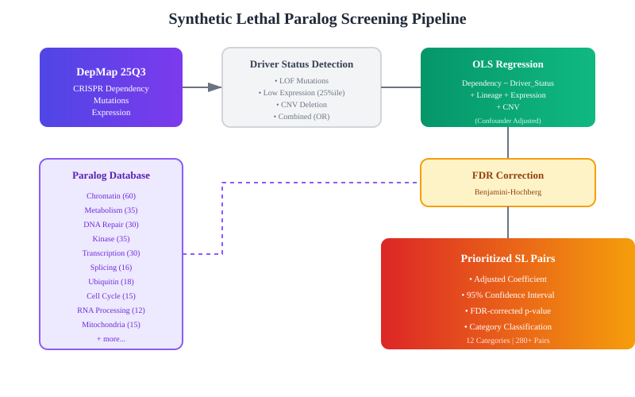

# DepMap-based In Silico Screening of Synthetic Lethal Paralogs

[](https://colab.research.google.com/github/takaakisasaki/DepMap-based-in-silico-screening-of-synthetic-lethal-paralogs/blob/main/comprehensive_paralog_scanner.ipynb)

A comprehensive pipeline for identifying synthetic lethal paralog pairs using DepMap Public 25Q3 CRISPR screening data with OLS-based confounder adjustment.

## Overview

This tool systematically scans paralog gene pairs across multiple functional categories to identify synthetic lethality relationships. When one paralog is lost (through mutation, low expression, or copy number deletion), the cancer cell becomes dependent on the remaining paralog for survival.



## Features

- **Comprehensive Database**: 280+ paralog pairs across 12 functional categories
- **OLS Confounder Adjustment**: Controls for tissue lineage, target expression, and CNV
- **DepMap 25Q3 Compatible**: Updated for latest data format changes
- **Multiple Stratification**: Mutation, expression, CNV, or combined analysis
- **FDR Correction**: Benjamini-Hochberg multiple testing correction
- **Rich Visualization**: Volcano plots, forest plots, heatmaps by category

## Categories Covered

| Category | Subcategories | Pairs |
|----------|---------------|-------|
| Chromatin | SWI/SNF, PRC, NuRD, HAT, HMT, KDM, Cohesin | ~60 |
| Metabolism | Glycolysis, TCA, Glutamine, Lipid, Nucleotide | ~35 |
| DNA Repair | HR, PARP, BER, MMR, NHEJ, FA, Checkpoint | ~30 |
| Kinase | CDK, MAPK, PI3K, RTK, Aurora, PLK, SRC | ~35 |
| Transcription | MYC, TEAD, SMAD, FOX, p53, RB, E2F | ~30 |
| Splicing | SF3B, U2AF, SRSF, hnRNP, snRNP | ~16 |
| Ubiquitin | E3 ligase, Cullin, TRIM, DUB | ~18 |
| Cell Cycle | Cyclin, CDKI, SAC, APC | ~15 |
| RNA Processing | DDX helicases, Translation, Ribosome | ~12 |
| Mitochondria | Respiratory chain, Fusion, Apoptosis | ~15 |
| Cytoskeleton | Actin, Tubulin, Kinesin, Dynein | ~10 |
| Signaling | Wnt, Notch, Hedgehog, NFkB, RAS | ~20 |

## Quick Start

### Google Colab (Recommended)

1. Click the "Open in Colab" badge above
2. Download DepMap 25Q3 data from [DepMap Portal](https://depmap.org/portal/download/all/)
3. Upload to your Google Drive
4. Run all cells

### Local Installation

```bash
git clone https://github.com/takaakisasaki/DepMap-based-in-silico-screening-of-synthetic-lethal-paralogs.git
cd DepMap-based-in-silico-screening-of-synthetic-lethal-paralogs
pip install -r requirements.txt
```

## Required Data

Download from [DepMap Portal](https://depmap.org/portal/download/all/) (DepMap Public 25Q3):

| File | Description | Size |
|------|-------------|------|
| `CRISPRGeneEffect.csv` | CRISPR dependency scores | ~200MB |
| `Model.csv` | Cell line metadata | ~5MB |
| `OmicsSomaticMutations.csv` | Somatic mutations | ~500MB |
| `OmicsExpressionTPMLogp1HumanProteinCodingGenes.csv` | Expression (TPM) | ~100MB |
| `OmicsCNGene.csv` | Copy number (optional) | ~50MB |

## Usage

```python
from paralog_scanner import DepMap25Q3Loader, ComprehensiveParalogScanner

# Load data
loader = DepMap25Q3Loader(data_dir="./depmap_25q3")
loader.load_all()

# Scan all paralog pairs
scanner = ComprehensiveParalogScanner(loader)
results = scanner.scan_all(stratify_by="any", min_affected=5)

# View results
print(f"Significant hits (FDR < 0.1): {results['significant_fdr10'].sum()}")
results[results['fdr'] < 0.1]
```

## Statistical Method

### Driver Status Detection

A gene is considered "affected" if any of the following conditions are met:

1. **LOF Mutation**: 
   - ProveanPrediction = "Damaging"
   - AMClass contains "pathogenic"
   - AMPathogenicity > 0.5
   - Frameshift insertion/deletion

2. **Low Expression**: Bottom 25th percentile

3. **CNV Deletion**: log2(CN/2) < -0.7

### OLS Regression Model

```
Target_Dependency ~ Driver_Status + Σ(Lineage_i) + Target_Expression + Target_CNV
```

- **Adjusted Coefficient**: Effect of driver loss on target dependency after controlling for confounders
- **95% CI**: Confidence interval for the coefficient
- **FDR**: Benjamini-Hochberg corrected p-value

## Example Results

### Top Hits (DepMap 25Q3)

| Driver | Target | Category | Adjusted Coef | FDR |
|--------|--------|----------|---------------|-----|
| SMARCA4 | SMARCA2 | Chromatin | -0.125 | 2.5e-16 |
| ARID1A | ARID1B | Chromatin | -0.089 | 1.2e-10 |
| STAG2 | STAG1 | Chromatin | -0.078 | 3.4e-08 |
| MTAP | PRMT5 | Metabolism | -0.156 | 8.7e-12 |

## Output Files

```
results/
├── all_paralog_scan_results.csv          # Full results
├── significant_hits_fdr10_all.csv        # FDR < 0.1 hits
└── by_category/
    ├── Chromatin_results.csv
    ├── Chromatin_significant.csv
    ├── Metabolism_results.csv
    ├── volcano_by_category.png
    ├── category_summary.png
    └── top_hits_forest.png
```

## Notebooks

| Notebook | Description |
|----------|-------------|
| `comprehensive_paralog_scanner.ipynb` | Full analysis (all categories) |
| `chromatin_paralog_scanner_25q3_fixed.ipynb` | Chromatin factors only |

## Citation

If you use this tool, please cite:

```bibtex
@software{sasaki2026depmap_paralog,
  author = {Sasaki, Takaaki},
  title = {DepMap-based In Silico Screening of Synthetic Lethal Paralogs},
  year = {2026},
  url = {https://github.com/takaakisasaki/DepMap-based-in-silico-screening-of-synthetic-lethal-paralogs}
}
```

## References

1. Tsherniak A, et al. (2017) Defining a Cancer Dependency Map. *Cell* 170:564-576
2. Hoffman GR, et al. (2014) Functional epigenetics approach identifies BRM/SMARCA2 as a critical synthetic lethal target in BRG1-deficient cancers. *PNAS* 111:3128-3133
3. Helming KC, et al. (2014) ARID1B is a specific vulnerability in ARID1A-mutant cancers. *Nature Medicine* 20:251-254
4. Mavrakis KJ, et al. (2016) Disordered methionine metabolism in MTAP/CDKN2A-deleted cancers leads to dependence on PRMT5. *Science* 351:1208-1213

## License

MIT License

## Contact

Takaaki Sasaki - Asahikawa Medical University Hospital
